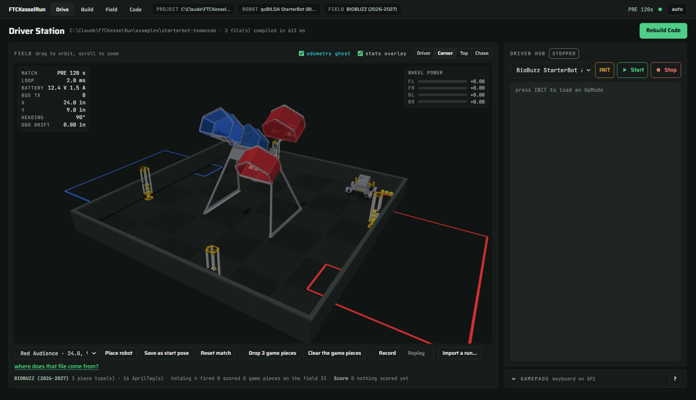
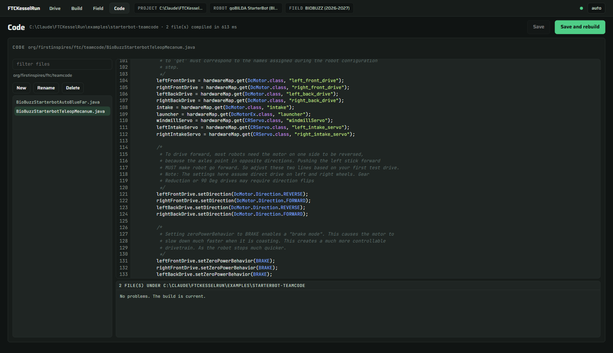
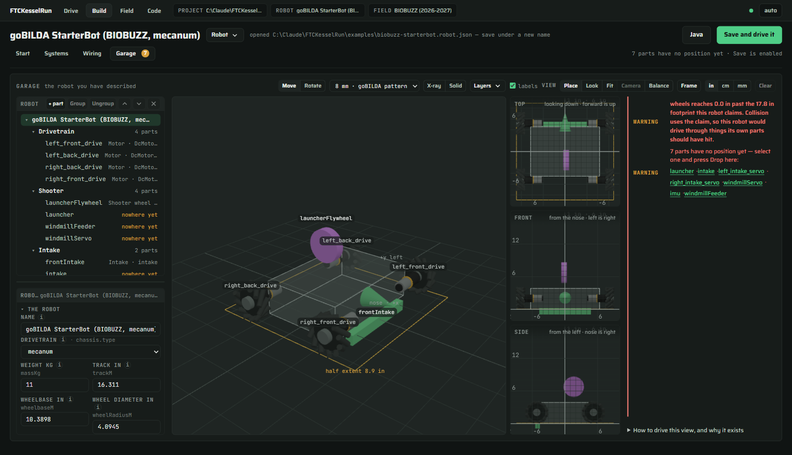

# FTCKesselRun

**An FTC robot simulator that runs your team's actual code.** Download it, double-click it,
drive. Nothing to install — no JDK, no Android Studio, no Gradle, no robot.

Your OpModes compile and run unmodified, because the simulator shadows the FTC SDK rather than
imitating it: `hardwareMap.get(DcMotor.class, "leftFront")` does what it does on a Control Hub.

> **Windows build.** The Java runtime in this download is Windows x64. The `.command` and `.sh`
> launchers are along for the ride and will not work on macOS or Linux yet.

---

## Get it

**[Download the ZIP](https://github.com/kevinappsdev/ftc-kessel-run/archive/refs/heads/main.zip)**
— about 53 MB.

1. Right-click the ZIP → **Properties** → tick **Unblock** → OK. *(Do this before extracting and
   Windows will not ask again. Skip it and SmartScreen says "Windows protected your PC" — click
   **More info** → **Run anyway**.)*
2. Extract it anywhere.
3. Double-click **`FTCKesselRun.cmd`**.

Your browser opens on `http://127.0.0.1:8730`. That is the whole install.

---

## Drive

The field is the page. Pick an OpMode, press **INIT**, then **Start**. A game controller is used
if one is plugged in; otherwise WASD drives and Q/E turns.

It opens on the **goBILDA StarterBot** on the **BIOBUZZ** field, because that is the kit
thousands of teams have and this season's game. **DECODE** ships too — the **FIELD** chip at the
top switches without restarting anything, and the **ROBOT** chip does the same for five robots.

Tick **stats overlay** and the match clock, loop time, battery, x, y, heading and odometry drift
are drawn over the field with the four wheel powers opposite.

---

## Write code

Press **PROJECT** and point it at the folder you cloned `FtcRobotController` into — or the
`TeamCode` inside it, or `TeamCode/src/main/java`. All of them resolve to the same source root,
and the page says which one it found. Your choice is remembered.

Every `.java` under that root, with the compiler's complaints on the lines they are on.
Ctrl+S saves and rebuilds. **No code yet?** Press **New project** and it writes a TeamCode
layout with a drivable TeleOp in it, at the exact path FIRST's own checkout uses.

**Your team's libraries resolve on their own** — Pedro Pathing, FTCLib, whatever your
`build.gradle` asks for — and they get the simulated clock too, so a path follower that sleeps
does not sleep in real time.

Sample code comes with it: a TeleOp and an autonomous for each robot, under `examples/`. They are
written for people learning to program, and the comments explain the thing that will actually
bite — why a gamepad's forward `y` is negative, why normalising mecanum powers matters more than
clipping them, why 170° minus −170° is not a 340° turn.

---

## Describe your robot

The simulator can only be right about what you tell it. A camera declared pitched 20° down when
it faces 20° up makes AprilTag relocalization impossible from every point on the field — and
that is one character in a file. Seeing it drawn is how you catch it.

**Build** walks it in four steps: **Systems** (what the robot does), **Wiring** (what drives
what, and which port), **Garage** (where each part actually is), and **Pipelines** (what each
Limelight pipeline looks for). The problems strip sorts complaints by who would refuse them — an
error the loader would reject, a warning a real hub would, a note for something real that has no
number yet.

Already have a Control Hub configuration? It gives you every device name exactly as your code
spells it, and importing it is one button.

---

## What it will not tell you

**A simulator that is vague about its own accuracy is worse than no simulator**, because a
confident wrong answer costs a competition day. So the honest version:

- **Scores are an upper bound.** Every shot is identical — no spin, no scatter, no aim noise —
  and there are no penalties.
- **The camera pose is deliberately wrong**, by an amount that grows with range, because a real
  one is. It is the same wrong answer every run, so your traces stay comparable.
- **Nothing here has been validated against a real robot on a real field.** Numbers that came
  from somewhere are cited where they live; numbers that were assumed say `ASSUMED`.

What *is* anchored: goBILDA's published torque curves, Logitech's published camera fields of
view, FIRST's own AprilTag detection ranges, and the BIOBUZZ field measured off the official CAD
and cross-checked against the manual.

---

## Licensing, and the CAD

**BSD 3-clause**, matching the FTC SDK's, so code moves between the two without anybody having to
wonder whether it may. **Not affiliated with or endorsed by FIRST.** `FIRST`, `FTC` and each
season's game name are trademarks.

This download includes meshes derived from FIRST's official field CAD and goBILDA's StarterBot
kit CAD, so the field and the robot are drawn rather than blocked out. Neither has been asked for
permission to redistribute them. If you intend to republish this build rather than use it, that
is worth taking up with them first.
